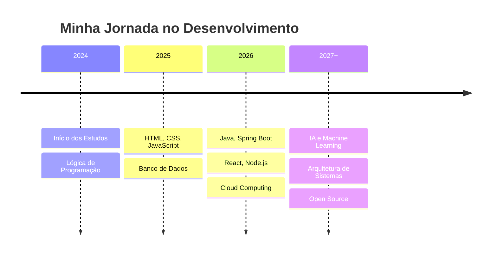

#  Olá! Eu sou Marcelo Moura

### 💻 Construindo conhecimento, desenvolvendo soluções e evoluindo todos os dias.

---

##  Sobre mim

Meu nome é **Marcelo Moura**, estudante de **Análise e Desenvolvimento de Sistemas** e apaixonado por transformar ideias em soluções tecnológicas que realmente fazem diferença.

Acredito que desenvolver software vai além do código: é sobre entender problemas, criar experiências melhores e colaborar para um mundo mais conectado.

 

  <table>
    <tr>
      <td align="center" style="padding: 15px; background: #161b22; border-radius: 15px; border: 1px solid #30363d;">
        📍 
        <strong>Brasil</strong> 
        São Paulo - SP
      </td>
      <td style="width: 20px;"></td>
      <td align="center" style="padding: 15px; background: #161b22; border-radius: 15px; border: 1px solid #30363d;">
        🎓 
        <strong>Análise e Desenvolvimento</strong> 
        de Sistemas
      </td>
      <td style="width: 20px;"></td>
      <td align="center" style="padding: 15px; background: #161b22; border-radius: 15px; border: 1px solid #30363d;">
        💼 
        <strong>Em Busca da</strong> 
        Primeira Oportunidade
      </td>
    </tr>
  </table>

---

##  Minha Trajetória

Tudo começou com a curiosidade de entender o que acontece *"por trás das telas"* dos aplicativos e sites que usamos todos os dias. Essa vontade de descobrir me levou ao universo da programação — onde encontrei uma área que combina lógica, criatividade e aprendizado contínuo.

 

  

 

Hoje, evoluo constantemente através de:

  <table>
    <tr>
      <td align="center" style="padding: 12px 20px; background: #161b22; border-radius: 10px; border: 1px solid #30363d;">
        📚 Cursos e Bootcamps
      </td>
      <td style="width: 10px;"></td>
      <td align="center" style="padding: 12px 20px; background: #161b22; border-radius: 10px; border: 1px solid #30363d;">
        🧩 Desafios de Código
      </td>
      <td style="width: 10px;"></td>
      <td align="center" style="padding: 12px 20px; background: #161b22; border-radius: 10px; border: 1px solid #30363d;">
        📖 Estudos Contínuos
      </td>
      <td style="width: 10px;"></td>
      <td align="center" style="padding: 12px 20px; background: #161b22; border-radius: 10px; border: 1px solid #30363d;">
        🤝 Comunidades Dev
      </td>
    </tr>
  </table>

---

 Objetivos Profissionais

  <table>
    <tr>
      <td align="center" style="padding: 15px; background: #161b22; border-radius: 15px; border: 1px solid #30363d; width: 33%;">
        🎯
        <h4>Primeira Oportunidade</h4>
        Conquistar meu primeiro emprego como desenvolvedor
      </td>
      <td style="width: 15px;"></td>
      <td align="center" style="padding: 15px; background: #161b22; border-radius: 15px; border: 1px solid #30363d; width: 33%;">
        ☁️
        <h4>Cloud Computing</h4>
        Especializar-me em AWS, Azure ou GCP
      </td>
      <td style="width: 15px;"></td>
      <td align="center" style="padding: 15px; background: #161b22; border-radius: 15px; border: 1px solid #30363d; width: 33%;">
        🤖
        <h4>Inteligência Artificial</h4>
        Aprofundar em IA e Machine Learning
      </td>
    </tr>
    <tr>
      <td colspan="5" style="height: 10px;"></td>
    </tr>
    <tr>
      <td align="center" style="padding: 15px; background: #161b22; border-radius: 15px; border: 1px solid #30363d; width: 33%;">
        💼
        <h4>Full Stack</h4>
        Atuar com arquiteturas robustas e escaláveis
      </td>
      <td style="width: 15px;"></td>
      <td align="center" style="padding: 15px; background: #161b22; border-radius: 15px; border: 1px solid #30363d; width: 33%;">
        🌐
        <h4>Open Source</h4>
        Contribuir ativamente com projetos globais
      </td>
      <td style="width: 15px;"></td>
      <td align="center" style="padding: 15px; background: #161b22; border-radius: 15px; border: 1px solid #30363d; width: 33%;">
        📈
        <h4>Crescimento</h4>
        Liderar equipes e compartilhar conhecimento
      </td>
    </tr>
  </table>

---

 Tecnologias & Ferramentas

🚀 Back-end

🎨 Front-end

🗄️ Banco de Dados & DevOps

🛠️ Ferramentas & Outros

---

 Atualmente Estudando

  <table>
    <tr>
      <td align="center" style="padding: 15px; background: #161b22; border-radius: 12px; border: 1px solid #30363d; min-width: 150px;">
        ☕ 
        <strong>Java Avançado</strong> 
        Spring Boot, APIs REST
      </td>
      <td style="width: 10px;"></td>
      <td align="center" style="padding: 15px; background: #161b22; border-radius: 12px; border: 1px solid #30363d; min-width: 150px;">
        ⚛️ 
        <strong>React.js</strong> 
        Hooks, Context API
      </td>
      <td style="width: 10px;"></td>
      <td align="center" style="padding: 15px; background: #161b22; border-radius: 12px; border: 1px solid #30363d; min-width: 150px;">
        🐘 
        <strong>SQL Avançado</strong> 
        Modelagem, Otimização
      </td>
    </tr>
    <tr>
      <td colspan="5" style="height: 10px;"></td>
    </tr>
    <tr>
      <td align="center" style="padding: 15px; background: #161b22; border-radius: 12px; border: 1px solid #30363d; min-width: 150px;">
        🐳 
        <strong>Docker</strong> 
        Containerização
      </td>
      <td style="width: 10px;"></td>
      <td align="center" style="padding: 15px; background: #161b22; border-radius: 12px; border: 1px solid #30363d; min-width: 150px;">
        📊 
        <strong>Estrutura de Dados</strong> 
        Algoritmos, Padrões
      </td>
      <td style="width: 10px;"></td>
      <td align="center" style="padding: 15px; background: #161b22; border-radius: 12px; border: 1px solid #30363d; min-width: 150px;">
        🧠 
        <strong>IA & ML</strong> 
        Conceitos básicos
      </td>
    </tr>
  </table>

---

 Estatísticas do GitHub

  <table>
    <tr>
      <td align="center" style="padding: 20px 30px; background: #161b22; border-radius: 15px; border: 1px solid #30363d;">
        
📝

        
7

        
Contribuições Totais

        
30 Mai - Atual

      </td>
      <td style="width: 20px;"></td>
      <td align="center" style="padding: 20px 30px; background: #161b22; border-radius: 15px; border: 1px solid #30363d;">
        
🔥

        
0

        
Sequência Atual

        
22 Jul 2026

      </td>
      <td style="width: 20px;"></td>
      <td align="center" style="padding: 20px 30px; background: #161b22; border-radius: 15px; border: 1px solid #30363d;">
        
🏆

        
1

        
Maior Sequência

        
30 Mai 2026

      </td>
    </tr>
  </table>

 

  
  

 

  

---

 Conquistas no GitHub

  <table>
    <tr>
      <td align="center" style="padding: 12px 25px; background: #161b22; border-radius: 10px; border: 1px solid #30363d;">
        🎯 <strong>Primeiro Commit</strong>
        30 Maio 2026
      </td>
      <td style="width: 8px;"></td>
      <td align="center" style="padding: 12px 25px; background: #161b22; border-radius: 10px; border: 1px solid #30363d;">
        📁 <strong>Primeiro Repositório</strong>
        Em breve
      </td>
      <td style="width: 8px;"></td>
      <td align="center" style="padding: 12px 25px; background: #161b22; border-radius: 10px; border: 1px solid #30363d;">
        ⭐ <strong>Projeto em Destaque</strong>
        Em breve
      </td>
      <td style="width: 8px;"></td>
      <td align="center" style="padding: 12px 25px; background: #161b22; border-radius: 10px; border: 1px solid #30363d;">
        🤝 <strong>Colaboração</strong>
        Em breve
      </td>
    </tr>
  </table>

 

  

---

 Conecte-se Comigo

  
  &nbsp;
  
  &nbsp;
  
  &nbsp;
  
  &nbsp;
  
  &nbsp;
  
  &nbsp;
  
  &nbsp;
  

---

 Frase que me Inspira

  <blockquote style="border-left: 4px solid #58a6ff; padding-left: 20px; font-size: 20px; color: #c9d1d9;">
    <em>"A melhor maneira de prever o futuro é construí-lo, uma linha de código por vez."</em>
  </blockquote>

---

⭐ Obrigado pela Visita!

Seus comentários e feedbacks são sempre bem-vindos. Assim que publicar meus projetos, eles estarão disponíveis na aba de repositórios — não deixe de deixar uma ⭐ nos que te interessarem!

🚀 Sempre aprendendo. Sempre evoluindo.

---

